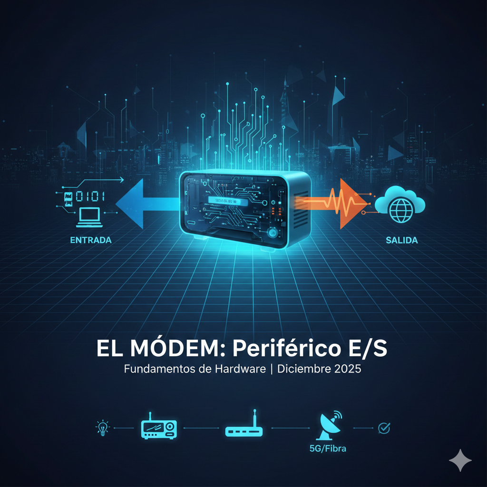

# 📚 Proyecto: Periféricos de Hardware

**Asignatura:** Fundamentos de Hardware  

**Tema:** El Módem como Periférico de Entrada/Salida (E/S)

---

## 📖 1. Descripción del Proyecto
Este documento ofrece una guía técnica y visual sobre el funcionamiento del **módem**, analizando su papel crítico en la conectividad moderna y su clasificación dentro de los sistemas informáticos.

---

## 📡 2. ¿Qué es un Módem? (Modulador-Demodulador)
El módem es un dispositivo de hardware que actúa como un puente entre los datos digitales de una computadora y las señales analógicas de las líneas de transmisión físicas.

### ⚙️ Procesos Fundamentales
1. **Modulación:** Proceso de convertir señales digitales (binarias) en ondas analógicas para su envío.
2. **Demodulación:** Proceso de transformar las ondas analógicas recibidas de nuevo en datos digitales legibles por el equipo.

---

## 📁 3. Tipos de Tecnologías y Conectividad

| Tecnología | Nombre Común | Medio de Transmisión | Estado |
| :--- | :--- | :--- | :--- |
| **Dial-up** | Telefónico | Par de cobre (Voz) | Obsoleto |
| **ADSL** | Banda Ancha | Par de cobre (Datos) | En desuso |
| **Cable (HFC)** | Módem Cable | Cable Coaxial | Común |
| **Fibra (ONT)** | Fibra Óptica | Pulsos de luz | Estándar actual |
| **Móvil** | 4G / 5G | Ondas de Radio | Ubicuo |

---

## 🎓 4. Clasificación como Periférico de E/S
En arquitectura de computadores, el módem se clasifica como un **periférico de Entrada/Salida (mixto)** debido a su naturaleza bidireccional:

* **Entrada:** Recibe datos desde una red externa hacia el sistema local (Descarga/Download).
* **Salida:** Envía datos desde el sistema local hacia la red externa (Carga/Upload).

---

## 📈 5. Evolución Histórica (1977 - 2026)
* **Años 80/90:** Módems de 56k con conexión por llamada telefónica.
* **Años 2000:** Introducción del ADSL; internet siempre activo sin bloquear la línea de voz.
* **Años 2010:** Transición masiva a la fibra óptica y el auge del Wi-Fi integrado.
* **Actualidad (2025-2026):** Predominio de redes 5G de baja latencia y fibra de 10 Gbps.

---

## 🎯 6. Aplicaciones Modernas
Hoy en día, el módem no solo sirve para navegar por la web, sino que es el corazón de:
* 🏠 **Domótica:** Control de hogares inteligentes.
* 🏭 **M2M e IoT:** Comunicación autónoma entre sensores y máquinas industriales.
* 🛰️ **Sistemas Satelitales:** Conectividad en zonas remotas de alta velocidad.

---

## ✅ Ventajas vs. ❌ Desventajas

### Ventajas
* Permite la comunicación global y el acceso remoto a la información.
* Versatilidad para adaptarse a distintos medios físicos (luz, radio, electricidad).
* Escalabilidad en velocidad y rendimiento.

### Desventajas
* Dependencia de la infraestructura del proveedor de servicios (ISP).
* Posibles cuellos de botella según la saturación de la red.
* Vulnerabilidad a ciberataques si el firmware no está actualizado.

---
